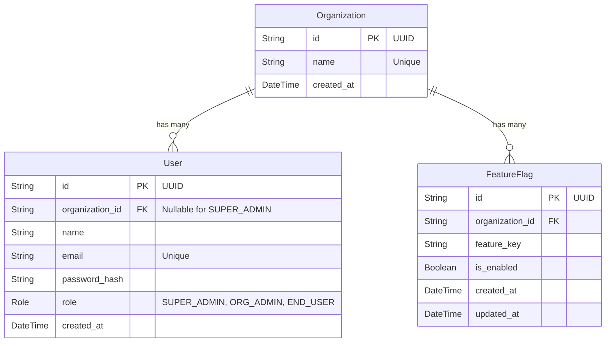

# Database Design (Phase 2B)

## ER Diagram

## Relationships
* **1 Organization → Many Users**: A user typically belongs to an organization, except `SUPER_ADMIN`s which are system-level and do not require an organization constraint.
* **1 Organization → Many Feature Flags**: Feature flags belong entirely to one organization.

## Constraints
* **Unique Email**: `users.email` is globally unique.
* **Unique Organization Name**: `organizations.name` is globally unique.
* **Unique Feature Key per Organization**: A composite unique index `@@unique([organizationId, featureKey])` ensures `feature_key` is unique within an organization, but can be reused across different organizations.
