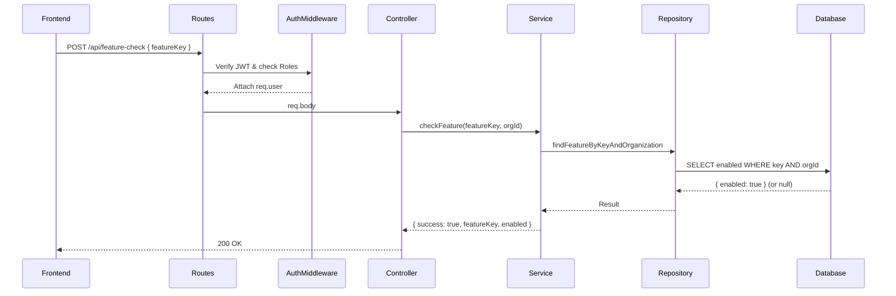

# Phase 6 - End User Feature Check API

## Architecture Flow
The End User Feature Check API leverages the established Clean Architecture of the Multi-Tenant SaaS platform. 
1. **Routes Layer**: Exposes `POST /api/feature-check` and `GET /api/feature-check/:featureKey`. Validates the caller via the `authenticate` middleware and guards it with `authorize(["END_USER", "ORG_ADMIN"])`. SUPER_ADMIN is explicitly denied.
2. **Controller Layer**: Extracts the `featureKey` either from the request body or URL parameters. It validates the format using a strict RegEx validation and ensures the `organizationId` is safely extracted from the user's JWT context (`req.user.organizationId`).
3. **Service Layer**: Receives the validated `featureKey` and `organizationId`. If the underlying repository returns `null` (because the feature does not exist or isn't assigned to that organization), it safely defaults to `enabled: false` instead of throwing an error. This fulfills the requirement of gracefully handling missing flags.
4. **Repository Layer**: Uses Prisma for an optimized, indexed database query. It queries `where: { featureKey, organizationId }` and explicitly adds `select: { enabled: true }` to minimize the database payload footprint.

## Security Explanation
This API handles the critical operation of resolving feature states for End Users. As it's meant to be polled frequently by frontends:
- **Zero Trust Inputs**: The API never accepts `organizationId` from a request body, path, or query parameter. The multi-tenant boundary is tightly enforced by strictly using the JWT payload (`req.user.organizationId`). 
- **Cross-Tenant Attack Prevention**: By appending the `organizationId` into the `WHERE` clause, the database inherently ignores any feature keys that might belong to another organization.
- **Graceful Defaults**: When an attacker attempts to guess feature keys from other organizations, the API simply returns `enabled: false`. It avoids exposing existence errors (e.g. `404 Not Found`) which could lead to enumeration attacks.

## Sequence Diagram


## Request Examples
### POST Request
```json
// POST /api/feature-check
{
  "featureKey": "new_dashboard"
}
```

### GET Request
`GET /api/feature-check/new_dashboard`

## Response Examples
### Success (Enabled)
```json
{
  "success": true,
  "featureKey": "new_dashboard",
  "enabled": true
}
```

### Feature Missing (or Disabled)
```json
{
  "success": true,
  "featureKey": "missing_feature",
  "enabled": false
}
```

### Error
```json
{
  "success": false,
  "message": "Feature key must be at least 2 characters long"
}
```

## RBAC Matrix
| Role | Access |
|---|---|
| END_USER | ✔ Allowed |
| ORG_ADMIN | ✔ Allowed |
| SUPER_ADMIN | ✘ Denied |
