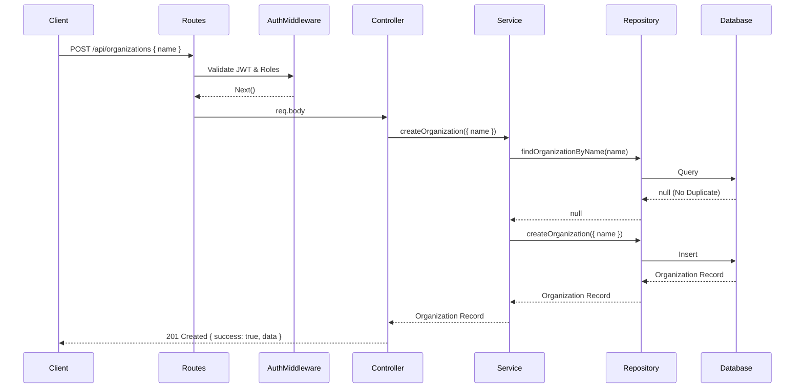

# Organization Management Module

## Architecture Explanation
The Organization Management Module follows a Clean Architecture approach with a strict separation of concerns, ensuring high maintainability, testability, and future scalability.
The layer hierarchy is as follows:
- **Routes Layer**: Exposes endpoints and applies middlewares (authentication and RBAC).
- **Controller Layer**: Parses requests, validates payloads, invokes the service layer, and shapes the standardized JSON responses.
- **Service Layer**: Contains business rules, validations (like duplicate checking), and throws appropriate AppErrors for expected failures.
- **Repository Layer**: Pure data access using Prisma ORM. No business logic resides here.
- **Types/Validation**: Strictly typed DTOs and standalone validation functions ensure predictable data flow.

## Request Flow Diagram


## API Documentation

### 1. Create Organization
- **Method**: `POST`
- **Endpoint**: `/api/organizations`
- **Roles Required**: `SUPER_ADMIN`
- **Request Body**:
  ```json
  {
    "name": "Velan Manufacturing"
  }
  ```
- **Responses**:
  - `201 Created`: Successfully created.
  - `400 Bad Request`: Validation failure (missing name, length constraints).
  - `409 Conflict`: Organization already exists (case-insensitive).

### 2. Get All Organizations
- **Method**: `GET`
- **Endpoint**: `/api/organizations`
- **Roles Required**: `SUPER_ADMIN`
- **Responses**:
  - `200 OK`: Returns count and data array ordered newest first.

### 3. Get Organization Details
- **Method**: `GET`
- **Endpoint**: `/api/organizations/:id`
- **Roles Required**: `SUPER_ADMIN`
- **Responses**:
  - `200 OK`: Returns organization details.
  - `400 Bad Request`: Invalid UUID format.
  - `404 Not Found`: Organization does not exist.

## Repository Layer Explanation
The `organization.repository.ts` file acts as the single source of truth for all database operations related to the `Organization` model. It leverages Prisma Client for strong typing and safe queries. It handles creation, finding by ID, finding by name (case-insensitive mode), listing with sorting, and counting. It does not throw domain errors or handle request validation.

## Service Layer Explanation
The `organization.service.ts` file encapsulates the core business logic. It orchestrates calls to the repository and enforces business rules:
- Duplicate checking: Compares normalized input against existing records. Example: "Velan" and "VELAN" are treated as duplicates.
- Validates the existence of records (e.g., throwing a `404 Not Found` if fetching by an invalid ID).

## RBAC Explanation
Role-Based Access Control is enforced at the route definition level.
We use two combined middlewares:
1. `authenticate`: Verifies the JWT and attaches the user payload to `req.user`.
2. `authorize(["SUPER_ADMIN"])`: Checks if `req.user.role` is present in the allowed roles array.
If an `ORG_ADMIN` or `END_USER` attempts to access any `/api/organizations` endpoint, the `authorize` middleware will intercept the request and throw a `403 Forbidden` error before the controller is even reached.
